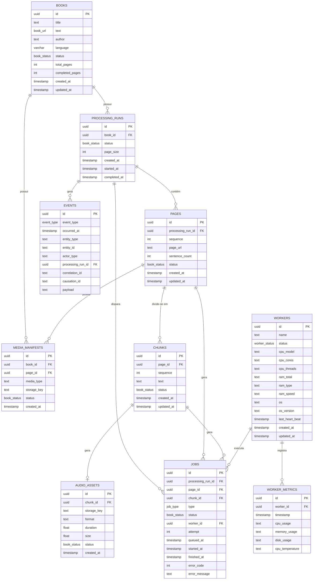

# Diagrama do Banco de Dados — ReadAlong

Diagrama entidade-relacionamento gerado a partir de [`schema.sql`](./schema.sql).

## Diagrama ER

## Cardinalidades

| De | Para | Cardinalidade | Significado |
|---|---|---|---|
| `books` | `processing_runs` | 1 : N | um livro tem várias execuções de processamento |
| `books` | `media_manifests` | 1 : N | um livro tem vários manifestos de mídia |
| `processing_runs` | `pages` | 1 : N | uma execução gera várias páginas |
| `processing_runs` | `jobs` | 1 : N | uma execução dispara vários jobs |
| `processing_runs` | `events` | 1 : N | uma execução gera vários eventos |
| `pages` | `chunks` | 1 : N | uma página se divide em vários chunks |
| `pages` | `media_manifests` | 1 : N | uma página tem vários manifestos |
| `pages` | `jobs` | 1 : N | uma página gera vários jobs |
| `chunks` | `audio_assets` | 1 : 1 | um chunk gera um único asset de áudio |
| `chunks` | `jobs` | 1 : N | um chunk gera vários jobs |
| `workers` | `worker_metrics` | 1 : N | um worker registra várias métricas |
| `workers` | `jobs` | 1 : N | um worker executa vários jobs |

## Enums

- **`book_status`**: `pending`, `processing`, `completed`, `completed_with_errors`, `failed`
- **`worker_status`**: `healthy`, `unhealthy`
- **`job_type`**: `analyze_grammar`, `generate_audio`, `generate_hls`
- **`event_type`**: `BOOK_CREATED`, `BOOK_PROCESSING_STARTED`, `BOOK_COMPLETED`, `BOOK_COMPLETED_WITH_ERRORS`, `PAGE_CREATED`, `PAGE_PROCESSING_STARTED`, `PAGE_COMPLETED`, `PAGE_FAILED`, `CHUNK_CREATED`, `CHUNK_COMPLETED`, `CHUNK_FAILED`, `JOB_CREATED`, `JOB_QUEUED`, `JOB_ASSIGNED`, `JOB_STARTED`, `JOB_COMPLETED`, `JOB_FAILED`, `JOB_RETRY`, `WORKER_REGISTERED`, `WORKER_ONLINE`, `WORKER_OFFLINE`, `WORKER_UNHEALTHY`, `WORKER_RECOVERED`, `AUDIO_GENERATED`, `AUDIO_UPLOADED`, `HLS_GENERATED`
